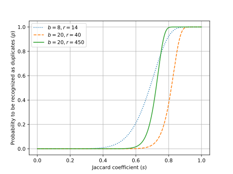

# Doubri

## はじめに

Doubriは、文書の重複除去（deduplication）、すなわち文書集合の中で類似した文書を除去するためのC++実装です。
以下の特徴があります。

+ Doubriは、分散並列処理のための特別なインフラ（Sparkなど）やファイルシステム（HDFSなど）を必要としません。基本的に、多数のCPUコア、大容量の主記憶、およびストレージを備えた計算環境（1ノード）で動作します。
+ Doubriが対象とする文書集合の形式は以下の通りです。
    + 各文書はJSONオブジェクトとしてエンコードされ、テキストは`text`キーの値として格納されている（キーの名前は`doubri-minhash`コマンドのオプションで指定できます）
    + 文書集合はJSON Lines形式（.jsonl）、つまり1行に1つのJSONオブジェクトとして格納されている
+ Doubriを利用する手順は以下の通りです。
    + `doubri-minhash`ユーティリティを用いて、文書集合（.jsonl）をMinHashファイル（.mh）に変換します。いったんMinHashファイルを作成したら、元の文書集合にアクセスすることなく、重複除去を実行できます（元の文書集合を計算環境のストレージに配置する必要はなく、Amazon S3などのクラウドストレージに保管しておけば十分です）。MinHashファイルを作成する処理は入力文書に対して並列化が可能ですので、文書集合を複数のファイルに分割しておけば、`parallel`コマンド (Tange, 2020) などで`doubri-minhash`コマンドを並列に実行し、処理を高速化できます。
    + `doubri-dedup`ユーティリティを用いて、文書集合（単一または複数の.mhファイル）に対して重複除去を実行します。このとき、以下の4つのファイル群が生成されます。
        + 文書の重複を表すフラグファイル (.dup): このファイルのサイズ（バイト数）は重複除去対象の文書の数に等しくなり、各バイトの値は対応する文書が重複である場合は`'D'`、重複ではない場合は空白`' '`となります。
        + MinHashのインデックスファイル (.index.?????.??): MinHashのバケットを小さい順に整列し並べたファイルです。処理の効率化のため、インデックスは分割して保存されるため、5文字の数字（?????の部分で、例えば00000など）と2文字の16進数（??の部分で、例えばFFなど）がファイル名に付きます。
        + 重複除去の処理対象となったMinHashファイル (.mh) のリストファイル (.src): このファイルはMinHashファイルに含まれる文書数とMinHashファイルのパスのタブ区切り形式です。
        + 重複除去のログファイル (.log): 重複除去により削除された文書の数や実行時間などの統計情報が書き込まれます。
    + もし、処理対象の文書が多すぎる等の理由で`doubri-dedup`ユーティリティだけでは重複除去を完了できない場合は、処理対象の文書集合をいくつかのグループに分割し、`doubri-dedup`を複数回実行します。これにより、グループ内で類似する文書は除去できますが、グループを横断して類似している文書は除去できていませんので、`doubri-merge`ユーティリティでグループを横断した重複除去を実行します。
    + `doubri-apply`ユーティリティは、フラグファイル (.dup) とリストファイル (.src) を受け取り、標準入力で与えられる文書集合 (.jsonl) の中から、非重複文書であるものを抽出します。この処理は、フラグファイルで対応する値が空白`' '`であるソースファイルの行を抽出することに対応します。
+ Doubriは、MinHash値をUnicode文字のn-gram上で計算します（UTF-8のバイト列ではありません）。 これは、非ASCII文字を使用する言語においてテキスト類似度を計算するうえで望ましい処理です。

日本語では、重複した状態を「ダブる」と言います（daburu、ダブる）と言いますが、ローマ字表記にすると、「ダブる」の語原であるdoubleとかけ離れてしまいますので、doubriと命名しました（doubliの方が語源に近いですが、スペルが近すぎるとウェブ検索でサジェストされてしまう可能性があるので、lをrに変更しました）。

## 使い方

Doubriは複数CPU、大量の主記憶、大量のストレージ（SSDを推奨）を備えた計算環境（1ノード）で動作するように設計されています。
ただし、処理対象のアイテム（文書やウェブページなど）の数や、重複除去の設定（重複と見なすジャッカード係数の閾値や精度）によっては、重複除去を一度に実行できる計算環境を準備できない可能性があります。
そのような場合は、重複除去の設定を見直すか、処理対象のアイテム集合をいくつかのグループに分割し、グループごとに重複除去を実行してから、グループ横断で重複除去を行います。
まずは、グループに分割して重複除去を行う必要があるかどうか判定する方法を説明してから、各ツールの使い方を説明します。

### 重複除去の条件と計算環境

まず、重複除去の条件を決定し、必要な計算環境を見積ります。

#### 処理対象のアイテム数を求める

処理対象のアイテム（文書やウェブページ）の数を把握しておきます。後の見積りで規模感を具体的に掴めるように、いくつか例を示します。

+ Common CrawlのDecember 2024 (CC-MAIN-2024-51) の全ウェブページ数: 2,635,362,356
+ Common CrawlのDecember 2024 (CC-MAIN-2024-51) の日本語のウェブページ数: 130,303,227
+ Common Crawlの2024年のアーカイブ（CC-MAIN-2024-*）に収録されている全ウェブページ数: 26,883,065,764
+ Common Crawlの2024年のアーカイブ（CC-MAIN-2024-*）に収録されている日本語のウェブページ数: 1,269,601,796
+ Common Crawl全体に収録されている日本語のウェブページ数（2025年3月まで）: 11,046,178,746

この数を変数$N$で表します。

#### アイテムを重複として認識する基準を決める

MinHash LSHでは、アイテムを重複と見なすときの類似度と精度を決定するパラメータとして、$b$と$r$があります。
アイテムの類似度はジャッカード係数で計測されます。
2つのアイテム間のジャッカード係数が$s$であるとき、MinHash LSHがその2つのアイテムを重複と認識する確率$p$は、以下の式で表されます。

$$
p = 1 - (1 - s^b)^r
$$

分かりにくいと思いますので、$b$と$r$に典型的な値を設定し、横軸にジャッカード係数$s$、縦軸に重複として認識する確率$p$をプロットしました。

$(b,r)=(8,14)$は[FineWeb](https://huggingface.co/datasets/HuggingFaceFW/fineweb) (Penedo et al., 2024) で採用されている設定です。ジャッカード係数が0.8のアイテムを92.4%の確率で重複と認識できますが、ジャッカード係数が0.6のアイテムも21.1%の確率で重複と認識してしまいます。もし、ジャッカード係数が0.6のアイテムを重複と見なしたくない場合でも、21.1%のアイテムが削除されてしまう（偽陽性）ことになります。

$(b,r)=(20,450)$は[RefinedWeb](https://huggingface.co/datasets/tiiuae/falcon-refinedweb) (Penedo et al., 2023) で採用されている設定です。ジャッカード係数が0.8のアイテムを99.5%の確率で重複と認識でき、ジャッカード係数が0.6のアイテムは1.6%の確率で重複と認識されます。

$(b,r)=(20,40)$は[Swallow](https://swallow-llm.github.io/) (Okazaki et al., 2024) で採用されている設定です。ジャッカード係数が0.8のアイテムを37.1%の確率で重複と認識でき、ジャッカード係数が0.6のアイテムは0.1%の確率で重複と認識されます。

このグラフや確率$p$の式から明らかなように、$b$の値を大きく設定すると、重複と認識するときの精度が向上し（グラフにおいて確率が$0$から$1$に変化するときの傾きが急になり）、重複除去における誤検出（偽陽性）や見逃し（偽陰性）を減らせます。
また、$r$の値を大きく設定すると、重複と判定するときのジャッカード係数の閾値が下がります。
このことから、$b$をできるだけ大きく設定し、$r$は狙いたいジャッカード係数の閾値に合わせることが理想ですが、以下で説明する計算量とトレードオフの関係にあります。

#### 必要な計算環境を見積る

$N, b, r$を決定すると、Doubriを実行するのに必要な主記憶とストレージの量を見積もることができます。必要な主記憶とストレージの最低量の計算式と、例示した処理対象のアイテム数で実際に計算した結果を表にまとめます。
なお、ここで求まる量には作業領域は含まれません。主記憶の作業領域はさほど必要ありませんが、ストレージは計算された量の2倍以上の領域を確保しておくのが望ましいです。また、ストレージとしてSSDを使うことを推奨します。

| 処理対象 | $b$ | $r$ | 主記憶 [B] | ストレージ [B] |
| :-- | --: | --: | --: | --: |
| (計算式) | | | $(8b+9)N$ | $(8b+8)rN$ |
| CC-MAIN-2024-51の全ページ | 8 | 14 | 192.4G | 2656.4G |
| CC-MAIN-2024-51の日本語ページ | 8 | 14 | 9.5G | 131.3G |
| 2024年のCommon Crawlの全ページ | 8 | 14 | 1962.5G | 27098.1G |
| 2024年のCommon Crawlの日本語ページ | 8 | 14 | 92.7G | 1279.8G |
| Common Crawl全体に含まれる日本語ページ | 8 | 14 | 806.4G | 11134.5G |
| CC-MAIN-2024-51の全ページ | 20 | 40 | 445.4G | 17709.6G |
| CC-MAIN-2024-51の日本語ページ | 20 | 40 | 22.0G | 875.6G |
| 2024年のCommon Crawlの全ページ | 20 | 40 | 4543.2G | 180654.2G |
| 2024年のCommon Crawlの日本語ページ | 20 | 40 | 214.6G | 8531.7G |
| Common Crawl全体に含まれる日本語ページ | 8 | 14 | 1866.8G | 74230.3G |
| CC-MAIN-2024-51の全ページ | 20 | 450 | 445.4G | 199233.4G |
| CC-MAIN-2024-51の日本語ページ | 20 | 450 | 22.0G | 9850.9G |
| 2024年のCommon Crawlの全ページ | 20 | 450 | 4543.2G | 2032359.8G |
| 2024年のCommon Crawlの日本語ページ | 20 | 450 | 214.6G | 95981.9G |
| Common Crawl全体に含まれる日本語ページ | 8 | 14 | 1866.8G | 835091.1G |

ここで求められる主記憶とストレージの量に合わせて、計算環境を用意する必要があります。
ただし、重複除去の対象アイテム数$N$や設定$b,r$によっては、計算環境を用意できないこともあると思います。
そのような場合は、設定$b,r$を見直すか、処理対象のアイテム集合をいくつかのグループに分割して、$N$を下げます。
そして、分割して実行した重複除去の結果を、後から統合し、グループ横断で重複しているアイテムを除去します。

例えば、Common Crawl全体に含まれる日本語ページに対して、重複除去を実行することを考えます。
$(b, r)=(8, 14)$の設定を採用した場合、主記憶が約1024GB、ストレージが約20～30Tくらいの計算環境を用意できれば、一度に重複除去を実行できます。
ところが、$(b, r)=(20, 40)$の設定を採用すると、一度に重複除去を実行できる計算環境を確保するのは難しいかもしれません。
そのような場合は、重複除去の処理対象を年やアーカイブ単位に分割して、対象文書数$N$を下げます。
仮に年単位に分割すると、2024年のアーカイブを処理するのに必要な主記憶の目安は214.6GB、ストレージの最低量は8.5TBですので、クラウドサーバで調達できる範囲の計算環境と言えるでしょう。

#### 各ユーティリティの計算量

| ユーティリティ | 処理内容 | 主記憶 [B] | ストレージ [B] | 処理時間 | 並列化 | 
| :-- | :- | --: | --: | --: | :-- |
| `doubri-minhash` | アイテムからMinHashを計算 | $512 \times 8br$ | $32+8brN$ | $O(brN)$ | 可 |
| `doubri-dedup` | グループ内の重複除去 | $(8b+9)N$ | $(8b+8)rN + N$ | $O(rN \log N)$ | 可 |
| `doubri-merge` | グループ横断の重複除去 | $\frac{(8b+9)N_\mathrm{all}}{256}$ | $N_\mathrm{all}$ | $O(N_\mathrm{all})$ | 不可 |

中には、用意することが困難な条件や設定もあるでしょう。
に対して、利用しようと考えている計算環境が

これを見ると、$(b,r)=(20, 450)$の設定で重複除去をするのは大変であることが分かります。

主記憶: 

+ 一度に実行できる重複除去のアイテム数は$2^{48}=281,474,976,710,656$件以下でなければならない

## 参考文献

+ Guilherme Penedo, Hynek Kydlíček, Loubna Ben allal, Anton Lozhkov, Margaret Mitchell, Colin Raffel, Leandro Von Werra, Thomas Wolf. 2024. The FineWeb Datasets: Decanting the Web for the Finest Text Data at Scale. NeurIPS 2024 Track Datasets and Benchmarks Spotlight.
+ Ole Tange. 2020. GNU Parallel 20201222 ('Vaccine'). Zenodo. [https://doi.org/10.5281/zenodo.4381888]([https://doi.org/10.5281/zenodo.4381888).